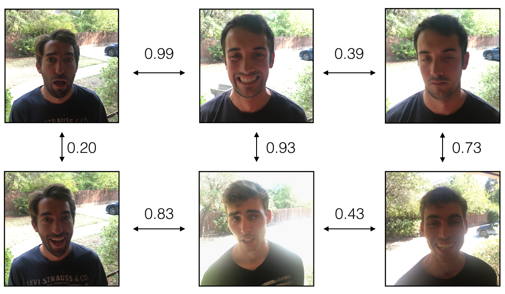

# Face Recognition

In this project, I'm going to build a face recognition system. Many of the ideas presented here are from [FaceNet](https://arxiv.org/pdf/1503.03832.pdf) and [DeepFace](https://research.fb.com/wp-content/uploads/2016/11/deepface-closing-the-gap-to-human-level-performance-in-face-verification.pdf).

Face recognition problems commonly fall into one of two categories: 

**Face Verification** "Is this the claimed person?" For example, at some airports, you can pass through customs by letting a system scan your passport and then verifying that you (the person carrying the passport) are the correct person. A mobile phone that unlocks using your face is also using face verification. This is a 1:1 matching problem.

**Face Recognition** "Who is this person?" For example, employees entering the office without needing to otherwise identify themselves. This is a 1:K matching problem.

FaceNet learns a neural network that encodes a face image into a vector of 128 numbers. After comparing two such vectors, we can then determine if two pictures are of the same person.

**Project Objectives**: 

* Implement one-shot learning to solve a face recognition problem
* Apply the triplet loss function to learn a network's parameters in the context of face recognition
* Explain how to pose face recognition as a binary classification problem
* Map face images into 128-dimensional encodings using a pretrained model
* Perform face verification and face recognition with these encodings

**Channels-last notation**

I'll be using a pre-trained model which represents ConvNet activations using a "channels last" convention, as used in many research papers. In other words, a batch of images will be of shape $(m, n_H, n_W, n_C)$. 

## Table of Contents

- [1 - Packages](#1)
- [2 - Naive Face Verification](#2)
- [3 - Encoding Face Images into a 128-Dimensional Vector](#3)
    - [3.1 - Using a ConvNet to Compute Encodings](#3-1)
    - [3.2 - The Triplet Loss](#3-2)
        - [triplet_loss](#-)
- [4 - Loading the Pre-trained Model](#4)
- [5 - Applying the Model](#5)
    - [5.1 - Face Verification](#5-1)
        - [verify](-)
    - [5.2 - Face Recognition](#5-2)
        - [who_is_it](-)
- [6 - References](#6)

<a name='1'></a>
## 1 - Packages

importing the packages 


```python
from tensorflow.keras.models import Sequential
from tensorflow.keras.layers import Conv2D, ZeroPadding2D, Activation, Input, concatenate
from tensorflow.keras.models import Model
from tensorflow.keras.layers import BatchNormalization
from tensorflow.keras.layers import MaxPooling2D, AveragePooling2D
from tensorflow.keras.layers import Concatenate
from tensorflow.keras.layers import Lambda, Flatten, Dense
from tensorflow.keras.initializers import glorot_uniform
from tensorflow.keras.layers import Layer
from tensorflow.keras import backend as K
K.set_image_data_format('channels_last')
import os
import numpy as np
from numpy import genfromtxt
import pandas as pd
import tensorflow as tf
import PIL

%matplotlib inline
%load_ext autoreload
%autoreload 2
```

<a name='2'></a>
## 2 - Naive Face Verification

In Face Verification, we're given two images and have to determine if they are of the same person. The simplest way to do this is to compare the two images pixel-by-pixel. If the distance between the raw images is below a chosen threshold, it may be the same person!


<caption><center> <u> <font color='purple'> <b>Figure 1</b> </u></center></caption>

Of course, this algorithm performs poorly, since the pixel values change dramatically due to variations in lighting, orientation of the person's face, minor changes in head position, and so on.

rather than using the raw image, I will use an encoding for the images, $f(img)$.

By using an encoding for each image, an element-wise comparison produces a more accurate judgement as to whether two pictures are of the same person.

<a name='3'></a>
## 3 - Encoding Face Images into a 128-Dimensional Vector

<a name='3-1'></a>
### 3.1 - Using a ConvNet to Compute Encodings

The FaceNet model takes a lot of data and a long time to train. So following the common practice in applied deep learning, I'll load weights that someone else has already trained. The network architecture follows the Inception model from [Szegedy *et al*..](https://arxiv.org/abs/1409.4842) An Inception network implementation can be found in the file `inception_blocks_v2.py` (closer look at how it is implemented).  

Key notes:

- This network uses 160x160 dimensional RGB images as its input. Specifically, a face image (or batch of $m$ face images) as a tensor of shape $(m, n_H, n_W, n_C) = (m, 160, 160, 3)$
- The input images are originally of shape 96x96, thus, they must be scaled to 160x160. This is done in the `img_to_encoding()` function.
- The output is a matrix of shape $(m, 128)$ that encodes each input face image into a 128-dimensional vector


```python
# To create the model for face images
from tensorflow.keras.models import model_from_json

json_file = open('keras-facenet-h5/model.json', 'r')
loaded_model_json = json_file.read()
json_file.close()
model = model_from_json(loaded_model_json)
model.load_weights('keras-facenet-h5/model.h5')
```


```python
# Summaries for the input and output shapes: 
print(model.inputs)
print(model.outputs)
```

    [<tf.Tensor 'input_1:0' shape=(None, 160, 160, 3) dtype=float32>]
    [<tf.Tensor 'Bottleneck_BatchNorm/batchnorm/add_1:0' shape=(None, 128) dtype=float32>]
    

By using a 128-neuron fully connected layer as its last layer, the model ensures that the output is an encoding vector of size 128. I will then use the encodings to compare two face images as follows:


<caption><center> <u> <font color='purple'> <b>Figure 2:</b> <br> </u> <font color='purple'>By computing the distance between two encodings and thresholding, I can easily determine if the two pictures represent the same person</center></caption>

So, an encoding is a good one if:

- The encodings of two images of the same person are quite similar to each other.
- The encodings of two images of different persons are very different.

The triplet loss function formalizes this, and tries to "push" the encodings of two images of the same person (Anchor and Positive) closer together, while "pulling" the encodings of two images of different persons (Anchor, Negative) further apart.
    
<br>
<caption><center> <u> <font color='purple'> <b>Figure 3: </b> <br> </u> <font color='purple'> I'll call the pictures from left to right: Anchor (A), Positive (P), Negative (N)</center></caption>

<a name='3-2'></a>
### 3.2 - The Triplet Loss

**Important Note**: By using a pretrained model, there is no need to implement the triplet loss function in this project. *However*, the triplet loss is the main ingredient of the face recognition algorithm. So, to ensure I know how to use it for training my own FaceNet model, as well as other types of image similarity problems, I'll implement it below, for fun and edification. :) 

For an image $x$, its encoding is denoted as $f(x)$, where $f$ is the function computed by the neural network.


Training will use triplets of images $(A, P, N)$:

- A is an "Anchor" image--a picture of a person.
- P is a "Positive" image--a picture of the same person as the Anchor image.
- N is a "Negative" image--a picture of a different person than the Anchor image.

These triplets are picked from the training dataset. $(A^{(i)}, P^{(i)}, N^{(i)})$ is used here to denote the $i$-th training example.

I'd like to make sure that an image $A^{(i)}$ of an individual is closer to the Positive $P^{(i)}$ than to the Negative image $N^{(i)}$) by at least a margin $\alpha$:

$$
|| f\left(A^{(i)}\right)-f\left(P^{(i)}\right)||_{2}^{2}+\alpha<|| f\left(A^{(i)}\right)-f\left(N^{(i)}\right)||_{2}^{2}
$$


Hence, I'd like to minimize the following "triplet cost":

$$\mathcal{J} = \sum^{m}_{i=1} \large[ \small \underbrace{\mid \mid f(A^{(i)}) - f(P^{(i)}) \mid \mid_2^2}_\text{(1)} - \underbrace{\mid \mid f(A^{(i)}) - f(N^{(i)}) \mid \mid_2^2}_\text{(2)} + \alpha \large ] \small_+ \tag{3}$$
Here, the notation "$[z]_+$" is used to denote $max(z,0)$.

**Notes**:

- The term (1) is the squared distance between the anchor "A" and the positive "P" for a given triplet; (want this to be small).
- The term (2) is the squared distance between the anchor "A" and the negative "N" for a given triplet, (want this to be relatively large). It has a minus sign preceding it because minimizing the negative of the term is the same as maximizing that term.
- $\alpha$ is called the margin. It's a hyperparameter is picked manually. I'll use $\alpha = 0.2$.

Most implementations also rescale the encoding vectors to haven L2 norm equal to one (i.e., $\mid \mid f(img)\mid \mid_2$=1); but this step is skipped in this project

<a name='-'></a>
### triplet_loss

Implementing the triplet loss as defined by formula (3). This will be done below by the follwing 4 steps:

1. Compute the distance between the encodings of "anchor" and "positive": $\mid \mid f(A^{(i)}) - f(P^{(i)}) \mid \mid_2^2$
2. Compute the distance between the encodings of "anchor" and "negative": $\mid \mid f(A^{(i)}) - f(N^{(i)}) \mid \mid_2^2$
3. Compute the formula per training example: $ \mid \mid f(A^{(i)}) - f(P^{(i)}) \mid \mid_2^2 - \mid \mid f(A^{(i)}) - f(N^{(i)}) \mid \mid_2^2 + \alpha$
4. Compute the full formula by taking the max with zero and summing over the training examples:$$\mathcal{J} = \sum^{m}_{i=1} \large[ \small \mid \mid f(A^{(i)}) - f(P^{(i)}) \mid \mid_2^2 - \mid \mid f(A^{(i)}) - f(N^{(i)}) \mid \mid_2^2+ \alpha \large ] \small_+ \tag{3}$$


```python
def triplet_loss(y_true, y_pred, alpha = 0.2):
    """
    Implementation of the triplet loss as defined by formula (3)
    
    Arguments:
    y_true -- true labels, required when you define a loss in Keras, you don't need it in this function.
    y_pred -- python list containing three objects:
            anchor -- the encodings for the anchor images, of shape (None, 128)
            positive -- the encodings for the positive images, of shape (None, 128)
            negative -- the encodings for the negative images, of shape (None, 128)
    
    Returns:
    loss -- real number, value of the loss
    """
    
    anchor, positive, negative = y_pred[0], y_pred[1], y_pred[2]
    
    # Step 1: Compute the (encoding) distance between the anchor and the positive
    pos_dist = tf.reduce_sum(tf.square(tf.subtract(anchor , positive)),axis=-1)
    # Step 2: Compute the (encoding) distance between the anchor and the negative
    neg_dist = tf.reduce_sum(tf.square(tf.subtract(anchor , negative)),axis=-1)
    # Step 3: subtract the two previous distances and add alpha.
    basic_loss = pos_dist - neg_dist + alpha
    # Step 4: Take the maximum of basic_loss and 0.0. Sum over the training examples.
    loss = tf.reduce_sum(tf.maximum(basic_loss, 0), axis = None)
    
    return loss
```

<a name='4'></a>
## 4 - Loading the Pre-trained Model

FaceNet is trained by minimizing the triplet loss. But since training requires a lot of data and a lot of computation, I won't train it from scratch here. Instead, I'll load a previously trained model in the following cell


```python
FRmodel = model
```

Here are some examples of distances between the encodings between three individuals:

<br>
<caption><center> <u> <font color='purple'> <b>Figure 4:</b></u> <br>  <font color='purple'> Example of distance outputs between three individuals' encodings</center></caption>

Now I'll use this model to perform face verification and face recognition!

<a name='5'></a>
## 5 - Applying the Model

**Problem Statement:**
You're building a system for an office building where the building manager would like to offer facial recognition to allow the employees to enter the building.

You'd like to build a face verification system that gives access to a list of people. To be admitted, each person has to swipe an identification card at the entrance. The face recognition system then verifies that they are who they claim to be.

<a name='5-1'></a>
### 5.1 - Face Verification

Now, I'll build a database containing one encoding vector for each person who is allowed to enter the office. To generate the encoding, I'll use `img_to_encoding(image_path, model)`, which runs the forward propagation of the model on the specified image.

The database (represented as a Python dictionary), maps each person's name to a 128-dimensional encoding of their face.


```python
#tf.keras.backend.set_image_data_format('channels_last')
def img_to_encoding(image_path, model):
    img = tf.keras.preprocessing.image.load_img(image_path, target_size=(160, 160))
    img = np.around(np.array(img) / 255.0, decimals=12)
    x_train = np.expand_dims(img, axis=0)
    embedding = model.predict_on_batch(x_train)
    return embedding / np.linalg.norm(embedding, ord=2)
```


```python
database = {}
database["danielle"] = img_to_encoding("images/danielle.png", FRmodel)
database["younes"] = img_to_encoding("images/younes.jpg", FRmodel)
database["tian"] = img_to_encoding("images/tian.jpg", FRmodel)
database["andrew"] = img_to_encoding("images/andrew.jpg", FRmodel)
database["kian"] = img_to_encoding("images/kian.jpg", FRmodel)
database["dan"] = img_to_encoding("images/dan.jpg", FRmodel)
database["sebastiano"] = img_to_encoding("images/sebastiano.jpg", FRmodel)
database["bertrand"] = img_to_encoding("images/bertrand.jpg", FRmodel)
database["kevin"] = img_to_encoding("images/kevin.jpg", FRmodel)
database["felix"] = img_to_encoding("images/felix.jpg", FRmodel)
database["benoit"] = img_to_encoding("images/benoit.jpg", FRmodel)
database["arnaud"] = img_to_encoding("images/arnaud.jpg", FRmodel)
```

Loading the images of Danielle and Kian (as an example): 


```python
danielle = tf.keras.preprocessing.image.load_img("images/danielle.png", target_size=(160, 160))
kian = tf.keras.preprocessing.image.load_img("images/kian.jpg", target_size=(160, 160))
```


```python
np.around(np.array(kian) / 255.0, decimals=12).shape
```


    (160, 160, 3)


```python
kian
```


    

    


```python
np.around(np.array(danielle) / 255.0, decimals=12).shape
```


    (160, 160, 3)


```python
danielle
```


    

    


Now, when someone shows up at the front door and swipes their ID card (thus giving their name), I can look up their encoding in the database, and use it to check if the person standing at the front door matches the name on the ID.

<a name='-'></a>
### verify

I'll Implement the `verify()` function, which checks if the front-door camera picture (`image_path`) is actually the person called "identity" using the following steps:

- Compute the encoding of the image from `image_path`.
- Compute the distance between this encoding and the encoding of the identity image stored in the database.
- Open the door if the distance is less than 0.7, else do not open it.

I'll use the L2 distance to compare the L2 distance, to the threshold 0.7


```python
def verify(image_path, identity, database, model):
    """
    Function that verifies if the person on the "image_path" image is "identity".
    
    Arguments:
        image_path -- path to an image
        identity -- string, name of the person you'd like to verify the identity. Has to be an employee who works in the office.
        database -- python dictionary mapping names of allowed people's names (strings) to their encodings (vectors).
        model -- your Inception model instance in Keras
    
    Returns:
        dist -- distance between the image_path and the image of "identity" in the database.
        door_open -- True, if the door should open. False otherwise.
    """
    
    # Step 1: Compute the encoding for the image. Use img_to_encoding() see example above. 
    encoding = img_to_encoding(image_path, model)
    # Step 2: Compute distance with identity's image 
    dist = np.linalg.norm(encoding - database[identity])
    # Step 3: Open the door if dist < 0.7, else don't open 
    if dist < 0.7:
        print("It's " + str(identity) + ", welcome in!")
        door_open = True
    else:
        print("It's not " + str(identity) + ", please go away")
        door_open = False
        
    return dist, door_open
```

Younes is trying to enter the office and the camera takes a picture of him ("images/camera_0.jpg"). Let's run the verification algorithm on this picture:


```python
# BEGIN UNIT TEST
verify("images/camera_0.jpg", "younes", database, FRmodel)
# END UNIT TEST
```

    It's younes, welcome in!
    


    (0.5992949, True)


Benoit, who does not work in the office, stole Kian's ID card and tried to enter the office. The camera took a picture of Benoit ("images/camera_2.jpg). 


Running the verification algorithm to check if Benoit can enter:


```python
verify("images/camera_2.jpg", "kian", database, FRmodel)
```

    It's not kian, please go away
    


    (1.0259346, False)


<a name='5-2'></a>
### 5.2 - Face Recognition

Now, the face verification system is mostly working. But since Kian got his ID card stolen, when he came back to the office the next day he couldn't get in!

To solve this, I will change the face verification system to a face recognition system. This way, no one has to carry an ID card anymore. An authorized person can just walk up to the building, and the door will unlock for them!

I'll implement a face recognition system that takes as input an image, and figures out if it is one of the authorized persons (and if so, who). Unlike the previous face verification system, there is no need to get a person's name as one of the inputs.

<a name='-'></a>
### who_is_it

I will Implement `who_is_it()` with the following steps:

- Compute the target encoding of the image from `image_path`
- Find the encoding from the database that has smallest distance with the target encoding.
- Initialize the `min_dist` variable to a large enough number (100). (This helps keep track of the closest encoding to the input's encoding.)
- Loop over the database dictionary's names and encodings. 
- Compute the L2 distance between the target "encoding" and the current "encoding" from the database. If this distance is less than the min_dist, then set min_dist to dist, and identity to name.


```python
def who_is_it(image_path, database, model):
    """
    Implements face recognition for the office by finding who is the person on the image_path image.
    
    Arguments:
        image_path -- path to an image
        database -- database containing image encodings along with the name of the person on the image
        model -- your Inception model instance in Keras
    
    Returns:
        min_dist -- the minimum distance between image_path encoding and the encodings from the database
        identity -- string, the name prediction for the person on image_path
    """
    
    ## Step 1: Compute the target "encoding" for the image.
    encoding =  img_to_encoding(image_path, model)
    ## Step 2: Find the closest encoding #
    min_dist = 100
    
    # Loop over the database dictionary's names and encodings.
    for (name, db_enc) in database.items(): # database dictionary: {name: db_enc}
        # Compute L2 distance between the target "encoding" and the current db_enc from the database.
        dist = np.linalg.norm(encoding - database[name])
        # If this distance is less than the min_dist, then set min_dist to dist, and identity to name.
        if dist < min_dist:
            min_dist = dist
            identity = name
            
    if min_dist > 0.7:
        print("Not in the database.")
    else:
        print ("it's " + str(identity) + ", the distance is " + str(min_dist))
        
    return min_dist, identity
```

Younes is at the front door and the camera takes a picture of him ("images/camera_0.jpg"). Let's see if your `who_it_is()` algorithm identifies Younes.


```python
# BEGIN UNIT TEST
# Test 1 with Younes pictures 
who_is_it("images/camera_0.jpg", database, FRmodel)

# Test 2 with Younes pictures 
test1 = who_is_it("images/camera_0.jpg", database, FRmodel)
assert np.isclose(test1[0], 0.5992946)
assert test1[1] == 'younes'

# Test 3 with Younes pictures 
test2 = who_is_it("images/younes.jpg", database, FRmodel)
assert np.isclose(test2[0], 0.0)
assert test2[1] == 'younes'
# END UNIT TEST
```

    it's younes, the distance is 0.5992949
    it's younes, the distance is 0.5992949
    it's younes, the distance is 0.0
    

The face recognition system is working well! It not only lets in authorized persons, but now people don't need to carry an ID card around anymore!

**Revisiting Project Objectives**!

- Posed face recognition as a binary classification problem
- Implemented one-shot learning for a face recognition problem
- Applied the triplet loss function to learn a network's parameters in the context of face recognition
- Mapped face images into 128-dimensional encodings using a pretrained model
- Performed face verification and face recognition with these encodings

<font color='blue'>
    
**Final Notes**:

- Face verification solves an easier 1:1 matching problem; face recognition addresses a harder 1:K matching problem.
    
- Triplet loss is an effective loss function for training a neural network to learn an encoding of a face image.
    
- The same encoding can be used for verification and recognition. Measuring distances between two images' encodings allows you to determine whether they are pictures of the same person.

**Ways for future improvement to the facial recognition model**:

- Put more images of each person (under different lighting conditions, taken on different days, etc.) into the database. Then, given a new image, compare the new face to multiple pictures of the person. This would increase accuracy.

- Crop the images to contain just the face, and less of the "border" region around the face. This preprocessing removes some of the irrelevant pixels around the face, and also makes the algorithm more robust.

<a name='6'></a>
## 6 - References
1. Florian Schroff, Dmitry Kalenichenko, James Philbin (2015). [FaceNet: A Unified Embedding for Face Recognition and Clustering](https://arxiv.org/pdf/1503.03832.pdf)

2. Yaniv Taigman, Ming Yang, Marc'Aurelio Ranzato, Lior Wolf (2014). [DeepFace: Closing the gap to human-level performance in face verification](https://research.fb.com/wp-content/uploads/2016/11/deepface-closing-the-gap-to-human-level-performance-in-face-verification.pdf)

3. This implementation also took a lot of inspiration from the official FaceNet github repository: https://github.com/davidsandberg/facenet

4. Further inspiration was found here: https://machinelearningmastery.com/how-to-develop-a-face-recognition-system-using-facenet-in-keras-and-an-svm-classifier/

5. And here: https://github.com/nyoki-mtl/keras-facenet/blob/master/notebook/tf_to_keras.ipynb

## 🛠 Skills Used
Python, Deep Learning, Optimization, Neural Networks, Face Verification, Face Recognition, CNN


## 🚀 About Me
👋 Hi, I’m @Raed-Alshehri

👀 I’m interested in data science, machine learning, and statistics.

🌱 I’m applying my skills in the data analytics field using Python, R, and SQL


## 🔗 Links
[](https://raed-alshehri.github.io/RaedAlshehri.github.io/)
[](https://www.linkedin.com/in/raedalshehri/)


## Feedback

If you have any feedback, please reach out to me at alshehri.raeda@gmail.com
